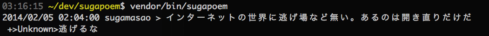

sugapoem
========

すがさんのポエムをCUIで読むためのコマンドです。



# require

* php>=5.4

# setup and how to use

Composerに対応していますので、みなさんのPCにかならず入っているであろう至高のパッケージャ、ComposerをつかえばgitでのCloneなど不要で一発で依存関係も解決してコマンドを入れる事ができます。

以下のcomposer.jsonを適当なディレクトリに作成し、

```
{
    "repositories": [
        {
            "url": "https://github.com/uzulla/SugaPoem.git",
            "type": "git"
        }
    ],
    "require":{
        "uzulla/sugapoem": "dev-master"
    }
}
```

Composer install を実行し、

```
$ composer install
```

インストールされたスクリプトを実行するだけでOKです。

```
$ vendor/bin/sugapoem
2014/02/05 02:04:00 sugamasao > インターネットの世界に逃げ場など無い。あるのは開き直りだけだ
 +>Unknown>逃げるな
```

# 他のどうでもいい機能

`\Uzulla\Pplog\Crawl`というのがなかにはいってます。
悪趣味なので使わない方が良いでしょう。

```
    $screen_name = 'sugamasao';
    try{
        $post = \Uzulla\Pplog\Crawl::get($screen_name);
    }catch(\Exception $e){
        echo "get fail: {$screen_name}\n";
        continue;
    }

    echo "{$post->created_at->format('Y/m/d H:i:s')} {$post->screen_name} > {$post->text}\n";

    if(!empty($post->comment_list)){
        foreach($post->comment_list as $comment){
            echo " +>{$comment->screen_name}>{$comment->text}\n";
        }
    }
```
